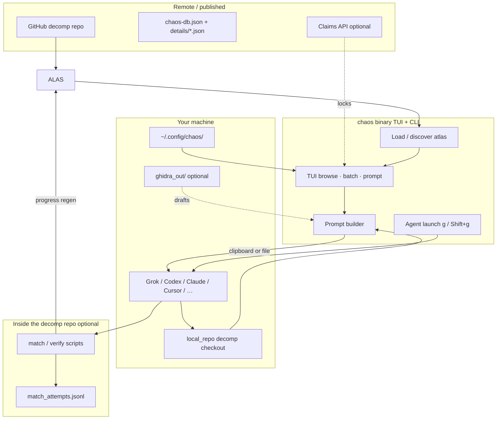
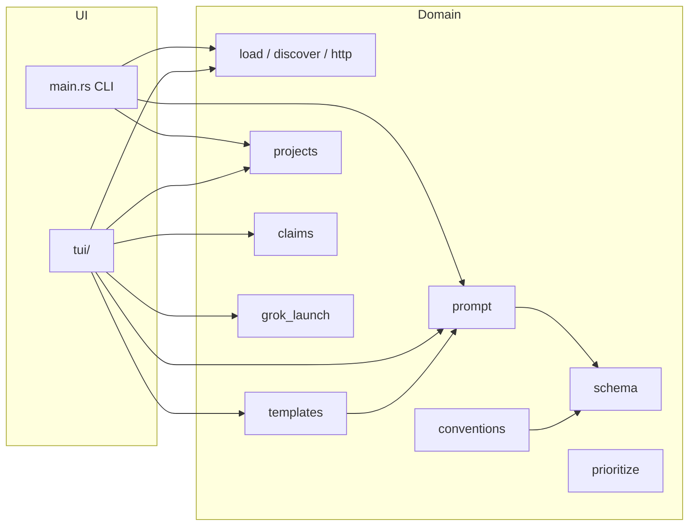
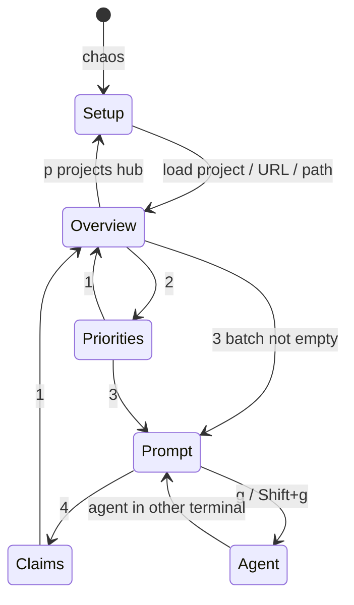
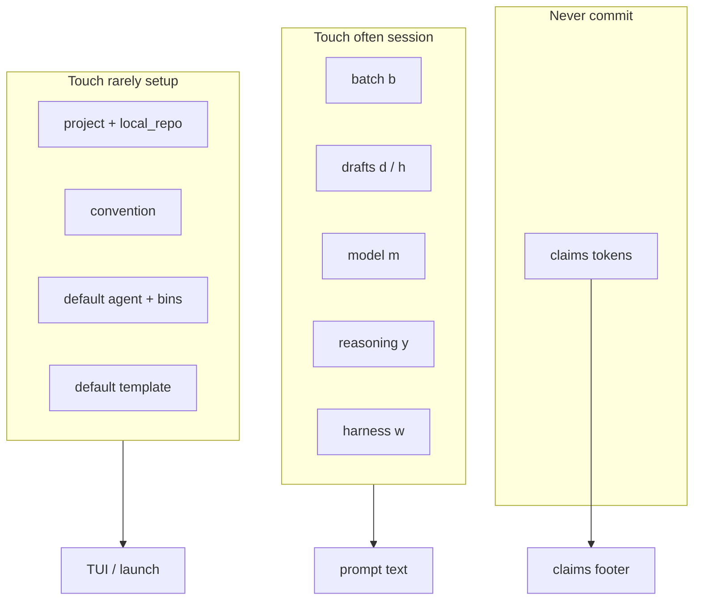
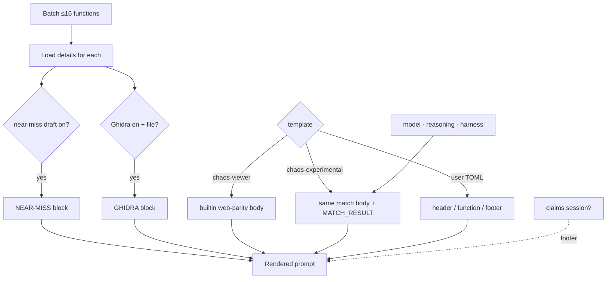
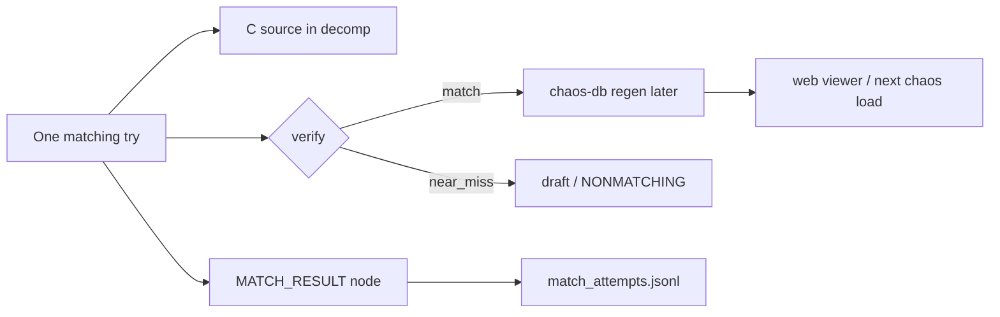
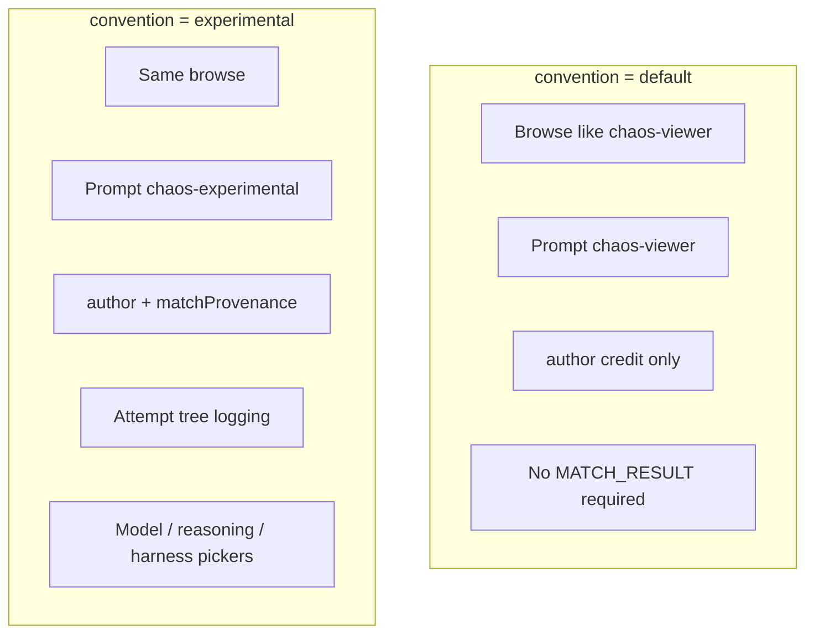
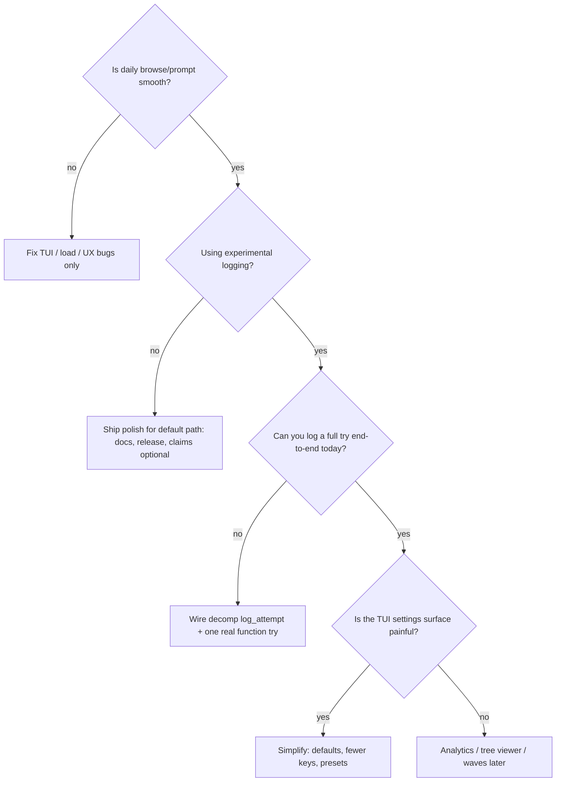

# Architecture map — chaos-viewer-cli

One-page map of the whole system: what lives where, what talks to what, and
which knobs matter. Use this when the TUI / config / provenance surface feels
too large to hold in your head.

**Want every role: tools, ledgers, agents, god graph (generic decomp)?** →
[`ecosystem.md`](ecosystem.md).

Related detail docs:

| Doc | Scope |
|-----|--------|
| [`schema.md`](schema.md) | `chaos-db.json` fields, provenance, attempt log |
| [`projects.md`](projects.md) | Multi-repo profiles, conventions |
| [`prompt-templates.md`](prompt-templates.md) | Templates + provenance pickers |
| [`claims-api.md`](claims-api.md) | Optional lock coordinator |

---

## 1. Big picture — three worlds

Chaos is **not** the decompiler and **not** the model. It is a **browser +
prompt factory** that sits between published atlas data and your matching tools.



**Mental model:**

| World | Owns | Chaos’s job |
|-------|------|-------------|
| **Atlas** | What’s matched, names, addrs | Load, browse, rank, show |
| **Chaos config** | Projects, templates, last model/harness | Remember operator prefs |
| **Decomp + agent** | Actual C, compile, verify, attempt log | Build prompt; optional launch |

---

## 2. Layers inside the binary



| Module | Responsibility |
|--------|----------------|
| `load` / `discover` / `http` | Find and fetch `chaos-db` + detail chunks |
| `schema` | Atlas types (`ChaosFunction`, `matchProvenance`, …) |
| `projects` | Saved multi-repo profiles + convention + `local_repo` |
| `conventions` | default vs experimental tracking rules |
| `prioritize` | Nearly / scaffolded / biggest / smallest lists |
| `prompt` | Built-in prompt bodies (viewer + experimental) |
| `templates` | User TOML templates + `config.toml` + provenance pickers |
| `claims` | Optional lock list / try-lock session |
| `grok_launch` | Spawn coding agent in a new terminal |
| `tui` | Screens, keys, batch, pickers |

---

## 3. TUI screens and the operator loop



| Screen | Job | High-traffic keys |
|--------|-----|-------------------|
| **Setup / projects** | Pick atlas source, convention, `local_repo` | enter, v, r, Shift+s |
| **Overview** | Modules + functions + detail | j/k h/l m s / b |
| **Priorities** | Ranked work queue | n b enter |
| **Prompt** | Build / copy / launch / provenance | t d h m y w c g |
| **Claims** | Read-only locks | r |

**Daily loop (happy path):**

```text
pick project → filter unmatched → b batch → Prompt
  → set model/reasoning/harness if experimental
  → d/h drafts as needed
  → c copy  or  g launch agent
  → agent matches in local_repo
  → (optional) log MATCH_RESULT → jsonl
  → u update atlas when progress lands
```

---

## 4. Config surfaces — every knob, one table

Too many settings feel worse when they live in different places. Here they are
grouped by **where they live** and **how often you touch them**.

### A. Per-project (`~/.config/chaos/projects.toml`)

| Knob | What | Touch often? |
|------|------|--------------|
| `source` | Atlas path / URL / GitHub | rare |
| `convention` | `default` \| `experimental` | rare |
| `local_repo` | Decomp checkout for agent cwd + ghidra | once per machine |

### B. Global chaos prefs (`~/.config/chaos/config.toml`)

| Knob | What | Touch often? |
|------|------|--------------|
| `default_template` | Prompt template id | rare |
| `active_project` | Last project | automatic |
| `default_agent` | `g` launches this | rare |
| `*_bin`, `*_extra_args`, `grok_mode`, `grok_terminal` | Agent plumbing | once |
| `grok_default_repo` | Fallback cwd if no `local_repo` | rare |
| **`provenance_model`** | Prefill MATCH_RESULT model | **per wave** |
| **`provenance_reasoning`** | high / medium / low / none | per wave |
| **`provenance_harness`** | which tool ran the try | per wave |

### C. Session-only (TUI memory, not config)

| Knob | What |
|------|------|
| Batch of function ids | What the prompt is about |
| Draft toggles `d` / `h` | Include near-miss C / Ghidra C |
| Search / match filter / module sort | Navigation |
| Active template id | Until you Shift+t default |

### D. Secrets / env (never in git)

| Env | What |
|-----|------|
| `CHAOS_CLAIMS_*` | Claims session |
| `CHAOS_HOME` | Config root override |
| `CHAOS_GHIDRA_DIR` | Force ghidra dump path |
| `CHAOS_PROJECT` / CLI flags | Non-TUI selection |

### E. Outside chaos (decomp owns these)

| Artifact | What |
|----------|------|
| `chaos-db.json` | Published progress atlas |
| `details/*.json` | Per-module disasm / drafts |
| `ghidra_out/` | Optional decompiler scaffolds |
| `config/match_attempts.jsonl` | Experimental attempt tree (metadata) |
| `nearmiss/db.jsonl` | Best near-miss tip **C** + `div` (sm64ds-shaped) |
| match/verify scripts | Ground truth for matched |



---

## 5. Prompt assembly (what actually goes into the model)



**Experimental-only extras on the prompt:**

- `MATCH_RESULT` YAML scaffold (tree ids, draft trackers, prefilled provenance)
- Inheritance rules for `usedGhidraDraft` / `usedNearMissDraft`

**Default / sm64ds path:** no MATCH_RESULT requirement; simpler mental load.

---

## 6. Data products after a try



| Store | Size | Role |
|-------|------|------|
| **Atlas** | lean | Final `matched` + `author` + optional `matchProvenance` |
| **jsonl attempt tree** | fat history | Every try, dead ends, parent links |
| **Source tree** | the work | Actual C that compiles |

---

## 7. Two conventions (don’t mix them in your head)



If you are **not** running experimental logging, most provenance UI is noise —
use a **default** project (e.g. sm64ds) and ignore `m` / `y` / `w`.

---

## 8. Complexity map — what earns its weight

| Area | Complexity | Value | Keep if… |
|------|------------|-------|----------|
| Multi-project + `local_repo` | medium | high | You switch decomps |
| Overview + priorities + batch | medium | **core** | Always |
| Prompt templates | medium | high | Custom project rules |
| Agent launch | medium | high | You use `g` daily |
| Draft / Ghidra toggles | low–med | high for hard fns | You use scaffolds |
| Experimental MATCH_RESULT | **high** | high for research | You mine the jsonl |
| Provenance pickers | low | high for experimental | Same |
| Claims | medium | situational | Multi-person races |
| Duration / extra log fields | — | low for now | Skip until needed |

---

## 9. Suggested “what next” decision tree

Use this when choosing the next slice of work:



**Concrete next options (pick one lane):**

1. **Stabilize** — commit the WIP feature set, cut a clean PR stack, freeze knobs  
2. **Simplify** — presets (“cheap wave” / “premium wave”) instead of raw m/y/w  
3. **Close the loop** — ensure EP (or your decomp) actually appends MATCH_RESULT  
4. **Observe** — small script to summarize jsonl (wins by model, dead-end rate)  
5. **Do not add** — duration, more log fields, more models, more harnesses (for now)

---

## 10. One-screen cheatsheet

```text
LOAD        projects.toml source → chaos-db + details
BROWSE      Overview / Priorities → batch[b]
PROMPT      template[t] drafts[d/h] provenance[m/y/w] copy[c] agent[g]
WORK        agent in local_repo → verify
LOG         MATCH_RESULT → jsonl   (experimental only)
PUBLISH     regen atlas → next load [u]
```

Settings that are **setup once:** project, local_repo, agent bins, default template.  
Settings that are **per session / wave:** batch, drafts, model, reasoning, harness.
