# Full ecosystem map — every moving part

Literal inventory of the matching stack: chaos CLI, web viewer, **one generic
decomp repo**, agents, and optional services. Not tied to a specific game.

Companion: [`architecture.md`](architecture.md) is the short “how chaos fits.”
This file is the warehouse. In the TUI, page **`5` Tools** shows the same
instruments as **cards** (filter with `n`; ★ = present under `local_repo`).

Names like `match.py` / `bank.py` are **typical** instrument names used by
Chaos Viewer–compatible decomps. A given repo may implement a subset, rename
scripts, or add more — the **roles** stay the same.

---

## 0. Top level — products around a decomp

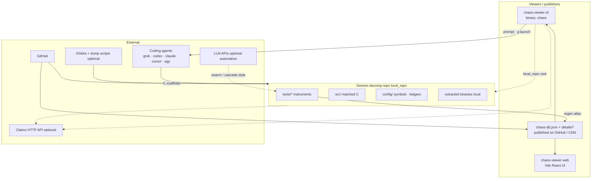

| Piece | Role |
|-------|------|
| **Decomp repo** | Source of truth for C, symbols, verify, ledgers, optional automation |
| **chaos-db + details** | Published progress atlas (no ROM bytes) |
| **chaos-viewer (web)** | Browser UI + original prompt shape |
| **chaos-viewer-cli** | Terminal browse + prompt factory + agent launch |
| **Agents** | Do the matching work in `local_repo` |
| **Claims API** | Optional multi-person locks |
| **Ghidra** | Optional decompiler scaffolds (not the matcher) |

---

## 1. chaos-viewer-cli — every Rust module

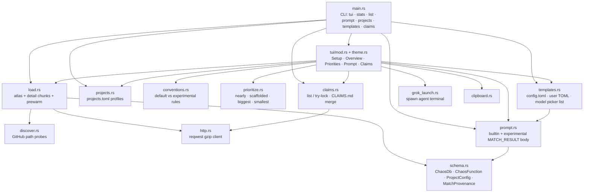

### CLI config / state (`~/.config/chaos/` or `$CHAOS_HOME`)

| Path | Written by | Contents |
|------|------------|----------|
| `config.toml` | templates / TUI | default_template, default_agent, agent bins/args, **provenance_model / reasoning / harness** |
| `projects.toml` | projects | profiles: source, convention, local_repo, active |
| `templates/*.toml` | user / Prompt `n` | custom prompt templates |
| `last-agent-run.command` | grok_launch | last launch helper script |

### Env vars

| Var | Effect |
|-----|--------|
| `CHAOS_HOME` | config root |
| `CHAOS_PROJECT` | active project id |
| `CHAOS_CLAIMS_*` | claims session / handle |
| `CHAOS_GHIDRA_DIR` | force ghidra dump path |
| `VISUAL` / `EDITOR` | template edit |

### TUI control groups

| Screen | State changers |
|--------|----------------|
| Setup | source, project list, convention `v`, local_repo `r`, save/delete |
| Overview | nav, filter `m`, sort `s`, search `/`, batch `b` |
| Priorities | mode `n`, batch, jump |
| Prompt | template `t`/`n`/`e`, drafts `d`/`h`, model `m`, reasoning `y`, harness `w`, copy `c`, agent `g` |
| Claims | refresh `r` |
| Global | pages 1–4, projects `p`, update atlas `u`, help `?` |

---

## 2. Web chaos-viewer

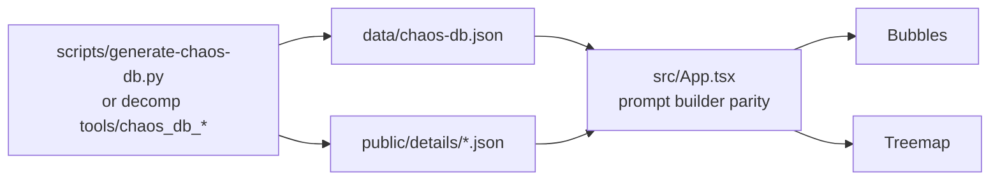

CLI built-in template **`chaos-viewer`** mirrors the web prompt shape. Experimental
template **`chaos-experimental`** adds MATCH_RESULT / provenance.

---

## 3. Generic decomp repo — layout

One checkout = one game. Chaos points at it via project **`local_repo`**.

```text
decomp-repo/
  src/                      # matched / NONMATCHING C
  config/                   # symbols, ledgers, project config
    **/symbols.txt          # function universe (name, addr, size, …)
    match_provenance.jsonl  # final HOW when banked (experimental)
    match_attempts.jsonl    # every try · attempt tree meta (experimental)
    nearmiss/db.jsonl       # best tip C + div (sm64ds-shaped)
  tools/                    # Python (and other) instruments — see §4
  arm9/ · arm7/ · …         # extracted bins (local; often gitignored)
  ghidra_out/               # optional decompiler C dumps (local)
  CLAIMS.md                 # optional lock mirror
  chaos-db.json             # optional committed atlas (or CI artifact)
  details/                  # optional committed detail chunks
```

Exact folder names vary (`progress/` vs `config/`, etc.). Chaos only requires a
**published atlas** to browse; the rest is for agents + verify + logging.

---

## 4. Generic decomp — instruments by role

Group by **what job they do**, not by which game invented them.

### 4a. Data stores

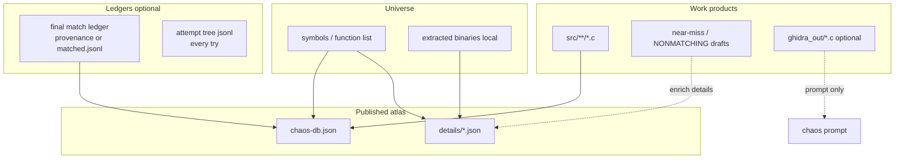

| Store | Role |
|-------|------|
| **Symbols / modules** | Full function universe for the atlas |
| **src/** | Ground-truth matched (or draft) C |
| **Final ledger** | Who/how when a match is banked (`matchProvenance`, author, …) |
| **Attempt tree** | Every try (dead ends too) — experimental |
| **Near-miss store** | Best incomplete C (file, db, or detail `draft`) |
| **chaos-db + details** | What viewers load |

### 4b. ROM → binaries → inspect

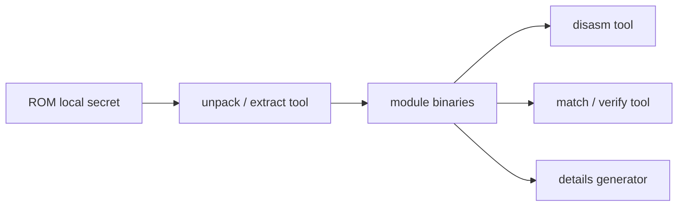

| Typical name | Role |
|--------------|------|
| **`unpack.py`** (or equivalent) | ROM → per-module bins |
| **`disasm.py`** | Capstone (or other) range dump |
| **`match.py`** | Compile candidate C + compare to target bytes (reloc-aware if needed) |
| Compiler toolchain | e.g. mwccarm / project compiler under `tools/` |

### 4c. Match loop instruments

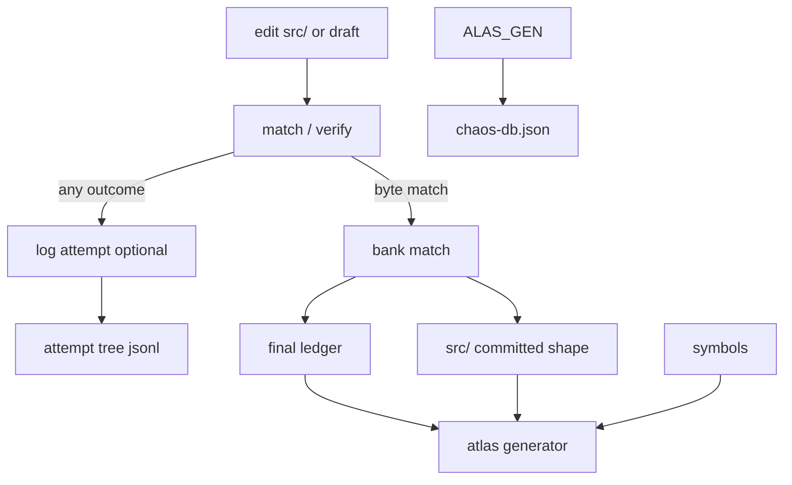

| Role | Typical tools | Required? |
|------|---------------|-----------|
| **Verify** | `match.py`, project `verify_command` in chaosviewer config | **yes** for real matches |
| **Log every try** | `log_attempt.py` + attempt-tree library | experimental |
| **Bank final match** | `bank.py` (+ provenance helpers) | if you enforce how-records |
| **Progress report** | `progress.py` | nice-to-have |
| **PR hygiene** | `pr_validate.py` | CI |
| **Atlas (CI-safe)** | `chaos_db_ci.py` — no ROM, committed data only | for publish |
| **Atlas (full)** | `generate-chaos-db.py` / `generate_details.py` — may need bins | for rich details |
| **Project blurb** | `chaosviewer.config.json` — name, github, rules, verify_command | for good prompts |

### 4d. Optional automation tier (not required for chaos)

Some repos add free or multi-tier matchers. Chaos does **not** run these; agents
or operators do.

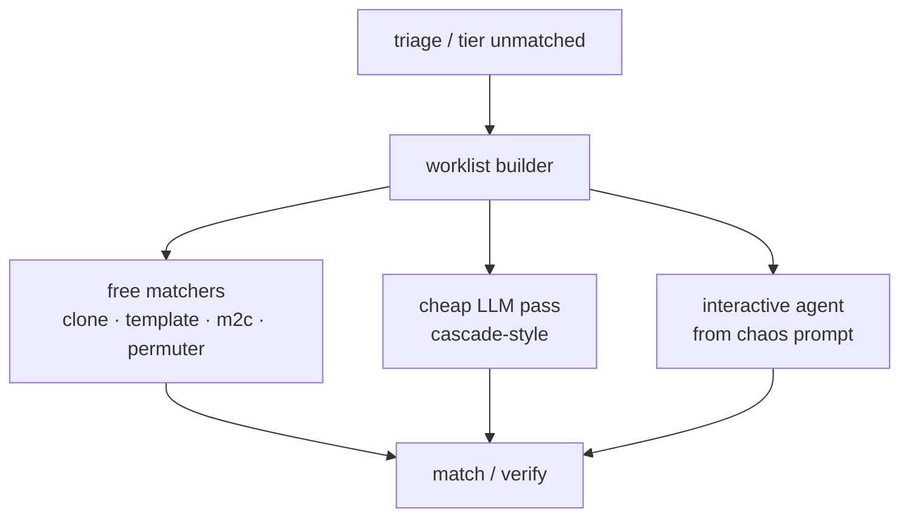

| Role | Examples of instruments |
|------|-------------------------|
| Triage | size/difficulty buckets |
| Worklist | JSONL of targets + context for batch agents |
| Free match | structural clone, param clone, template swarm, m2c draft, permuter |
| Similarity | opcode-similarity scheduler (coddog-style) |
| Cheap LLM | single-shot “fix this near-miss” API call |
| Knowledge base | tips file/db to shrink prompts |
| Batch harnesses | overnight sweeps, multi-function scripts |

Use them only if your decomp has them. Focused **chaos → agent → match → bank**
needs none of this tier.

### 4e. Coordination

| Role | Typical |
|------|---------|
| Claims client | `claims.py` or chaos `claims` CLI / TUI |
| CLAIMS.md | human-readable lock mirror in-repo |

### 4f. Ghidra (optional)

| Artifact | Role |
|----------|------|
| Ghidra project + dump script | Export approximate C per address |
| `ghidra_out/0xXXXXXXXX.c` | Consumed by chaos Prompt **`h`** when present |
| targets list | Which functions to dump |

Scaffolds are **hints**, not matches. Verify still decides.

---

## 5. Chaos ↔ decomp contract

What chaos actually needs from a repo:

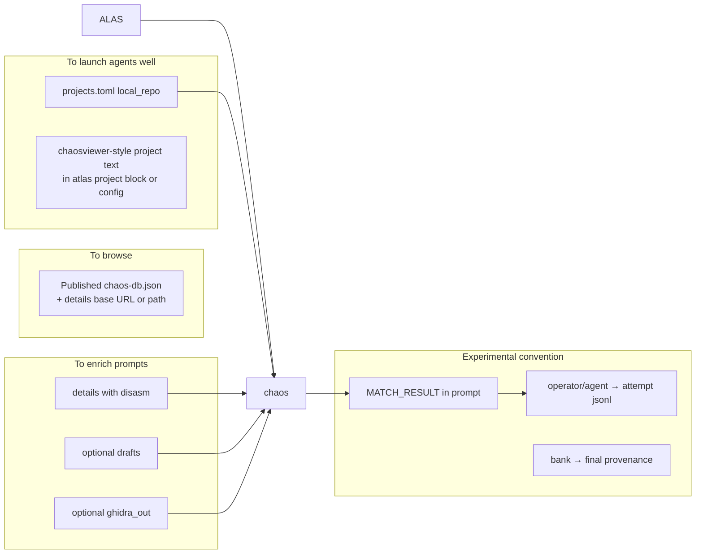

| Chaos feature | Decomp side |
|---------------|-------------|
| Load atlas | `chaos-db.json` (+ details) anywhere HTTP or path |
| Project profile | `source` + optional `local_repo` + `convention` |
| Prompt verify lines | `project.verifyCommand` / rules in atlas or config |
| Drafts `d` | detail `draft` or NONMATCHING C surfaced in details |
| Ghidra `h` | `local_repo/ghidra_out` or `CHAOS_GHIDRA_DIR` |
| Experimental | agent emits MATCH_RESULT; tools append attempt + bank ledgers |
| `g` launch | agent cwd = `local_repo` |

---

## 6. Conventions (repo policy, not game identity)

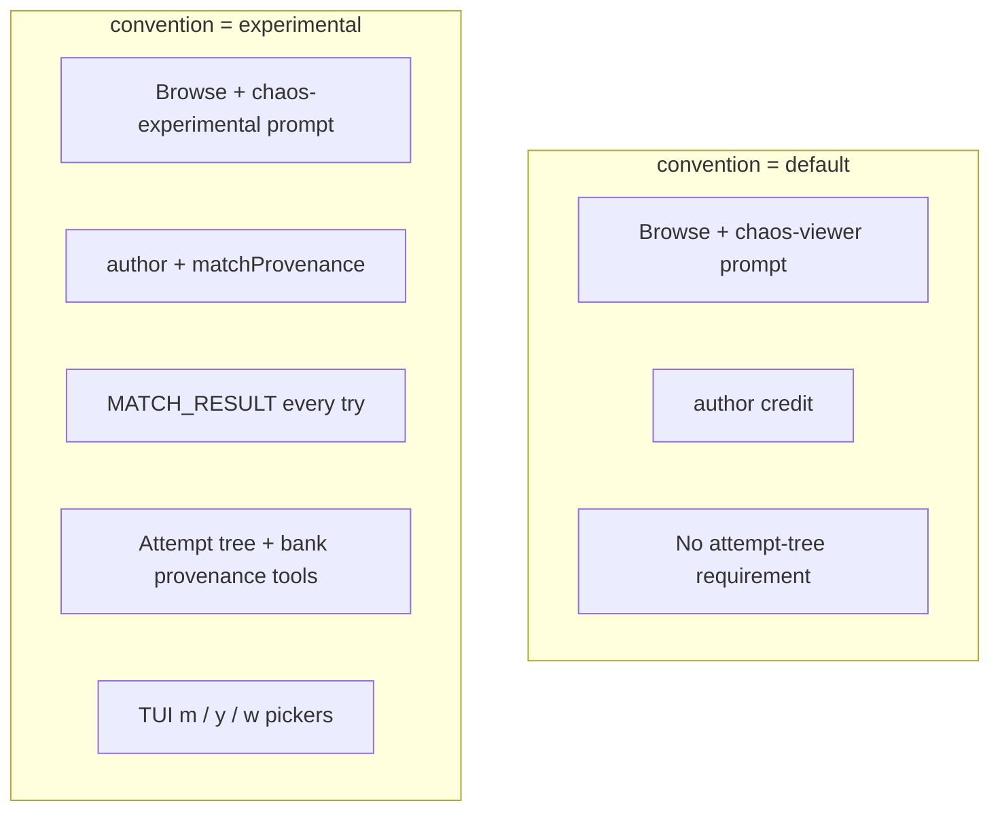

Same generic repo can use either convention. Experimental **adds** logging
discipline; it does not replace verify or src/.

---

## 7. End-to-end: one function (generic)

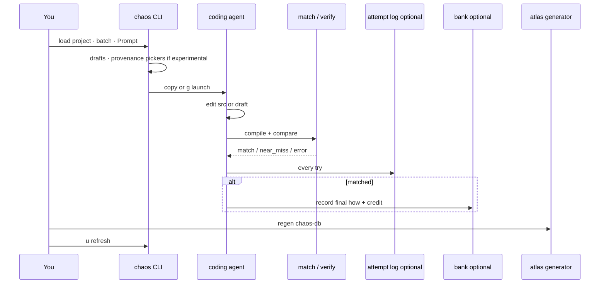

---

## 8. God graph — every touchpoint (generic)

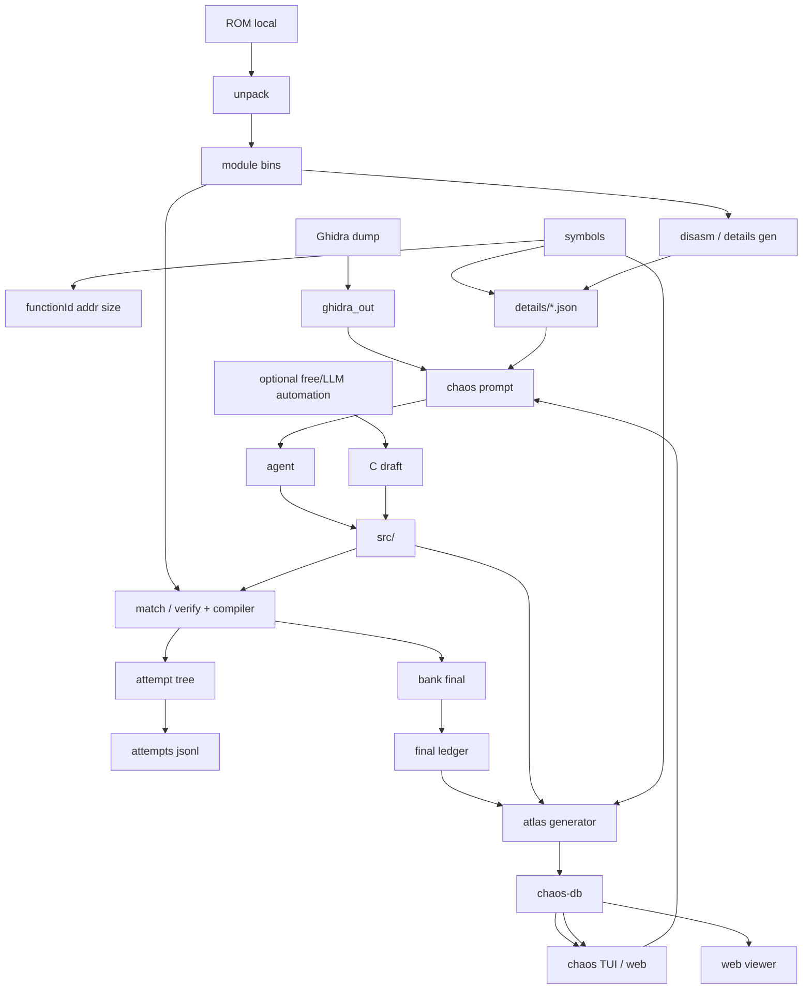

---

## 9. Shared non-Python pieces

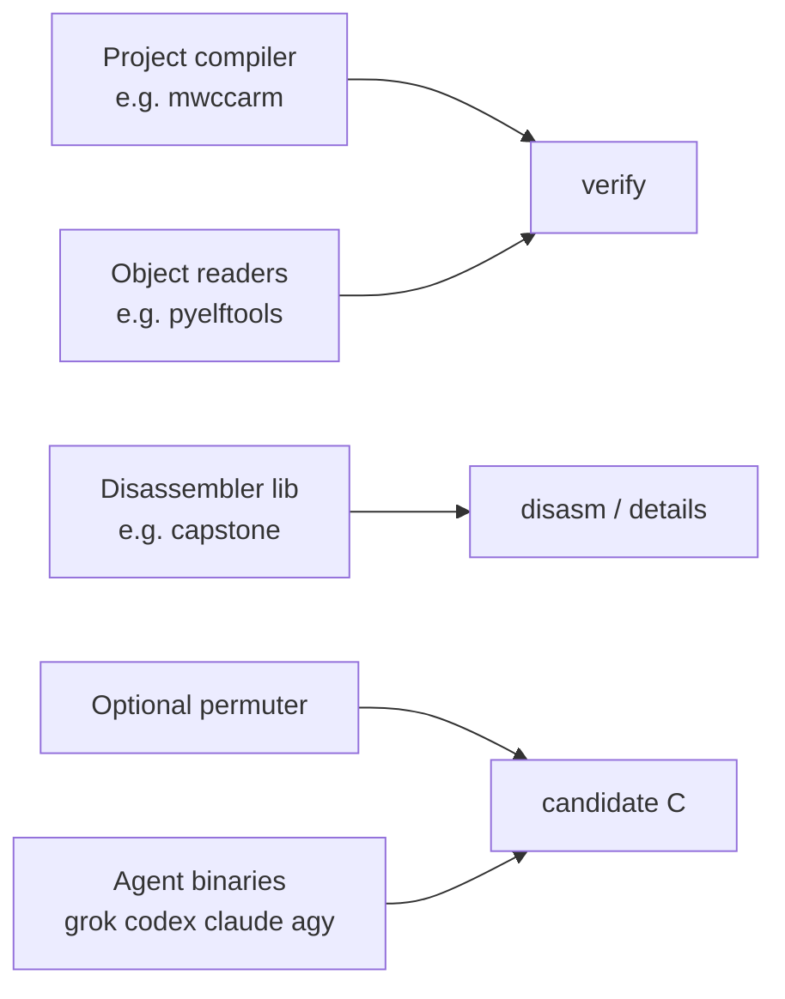

---

## 10. Coding agents

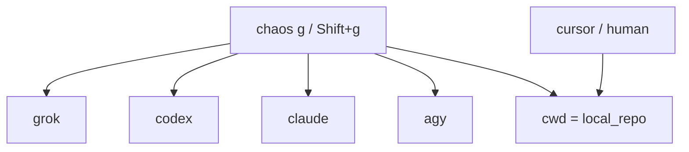

Harness slugs for MATCH_RESULT (`w`): `grok-build` · `cursor-agent` · `claude-code` · `codex` · `antigravity` · `manual`.  
Models (`m` picker): fixed slug list in CLI config (not per-game).

---

## 11. Claims (optional plane)

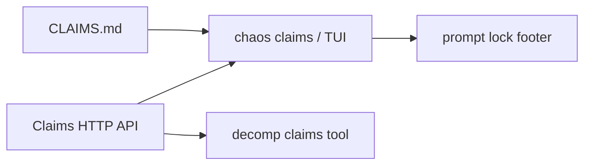

---

## 12. Checklist — tick what *your* repo has

### Core (most people)

- [ ] Published `chaos-db.json` (+ details)
- [ ] `chaos` TUI browse / batch / prompt
- [ ] `local_repo` set for agent cwd
- [ ] Verify tool (`match.py` or equivalent)
- [ ] Agent (any harness)
- [ ] `src/` edits

### Experimental logging

- [ ] convention = experimental
- [ ] Attempt log tool + jsonl
- [ ] Bank + final provenance ledger
- [ ] TUI `m` / `y` / `w`
- [ ] Draft / Ghidra toggles as needed

### Atlas maintainers

- [ ] CI-safe atlas generator
- [ ] Details generator (if you publish disasm)
- [ ] `chaosviewer.config.json` (or atlas `project` block)

### Optional factory

- [ ] Worklists / triage
- [ ] Free matchers / permuter
- [ ] Cheap LLM cascade
- [ ] Claims client
- [ ] Ghidra dumps

### Chaos-only setup (once)

- [ ] `projects.toml` profile
- [ ] default template / agent bins
- [ ] claims env if used

---

## 13. What next (using this map)

| Pain | Look at | Ignore |
|------|---------|--------|
| Too many chaos knobs | CLI Prompt + `config.toml` | factory automation |
| Attempts not logged | attempt log tool + agent discipline | more models |
| Atlas stale | atlas generator + `u` | claims |
| Bad match rate | verify, drafts, Ghidra, agent skill | new log fields |
| Want automation | optional factory tier in **this** repo | forking another game’s scripts blindly |

---

## 14. File index

| Location | Contents |
|----------|----------|
| `chaos-viewer-cli/src/*` | CLI modules (§1) |
| `~/.config/chaos/` | CLI state |
| chaos-viewer web tree | UI + optional generate-chaos-db |
| **`local_repo/`** | Generic decomp: tools, src, config, bins, ledgers |
| Published atlas URL/path | What chaos loads to browse |

When you add an instrument to a decomp, classify it by **role** (§4) and hang it
on the generic graphs — not under a game name.
